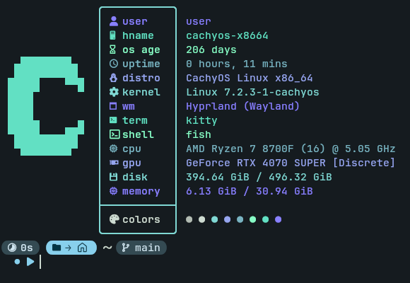

# My Custom Fastfetch Config

A clean, modern, and minimal config for [fastfetch](https://github.com). 

## 📸 Preview


## 🚀 Installation

1. **Backup your current config (optional):**
   ```bash
   mv ~/.config/fastfetch/config.jsonc ~/.config/fastfetch/config.jsonc.bak

2. Clone the repository and copy the config:
  ```bash
  git clone https://github.com/yourusername/my-fastfetch-repo.git
  cd my-fastfetch-repo
  mkdir -p ~/.config/fastfetch
  cp config.jsonc ~/.config/fastfetch/config.jsonc 

3. Run Fastfetch to see the result:
  ```bash
  fastfetch

## 📄 License
MIT
